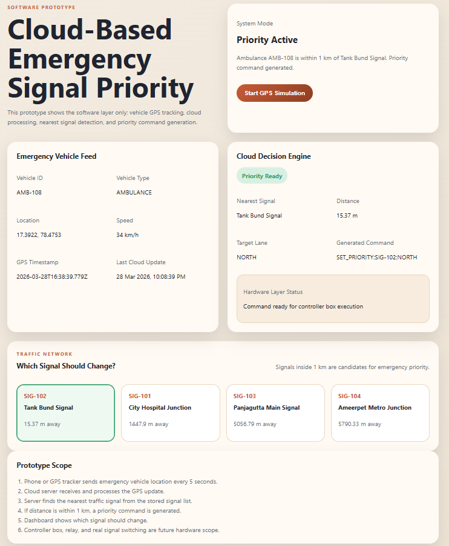

# 🚦 Smart Emergency Vehicle Priority System

🌐 **Live Demo:** https://smart-emergency-vehicle-signal-system.onrender.com

---

## 📌 Overview

This project is a software-based prototype of a cloud-driven traffic management system designed to prioritize emergency vehicles such as ambulances, fire trucks, and police vehicles.

The system simulates real-time GPS tracking of emergency vehicles and dynamically controls traffic signals to reduce delays and improve response time.

---

## 🚀 Key Features

* 🚑 Real-time emergency vehicle GPS simulation (updates every 5 seconds)
* ☁️ Cloud-based processing using Flask backend
* 📍 Intelligent detection of nearest traffic signal
* 🚦 Automatic priority signal activation within 1 km range
* 📊 Live dashboard for monitoring signal decisions

---

## 🛠️ Tech Stack

* Python (Flask)
* HTML, CSS, JavaScript
* REST-based communication

---

## ⚙️ How It Works

1. Emergency vehicle sends GPS data periodically
2. Flask server processes location data
3. Nearest traffic signal is identified
4. If within threshold distance, priority is assigned
5. Dashboard updates in real-time

---

## 📂 Project Structure

* `app.py` → Flask server & decision logic
* `ambulance.py` → GPS simulation script
* `templates/index.html` → Dashboard UI
* `static/style.css` → Styling
* `static/script.js` → Frontend logic
* `requirements.txt` → Dependencies

---

## ▶️ How to Run Locally

```bash
pip install -r requirements.txt
python app.py
```

Open in browser:
http://127.0.0.1:5000

---

## 📸 Output



---

## 🎯 Objective

To design a smart traffic control system that reduces delays for emergency vehicles and improves road safety using real-time data processing.

---

## 🔮 Future Enhancements

* 📍 GPS integration with real devices
* 🤖 AI-based route optimization
* 🗺️ Google Maps API integration
* 📡 Real-time traffic analytics

---

## 🔗 Links

* 🌐 Live Demo: https://smart-emergency-vehicle-signal-system.onrender.com
* 💻 GitHub Repo: https://github.com/GayathriTutika/smart-emergency-vehicle-signal-system

---

## 👤 Author

**Tutika Gayathri**
